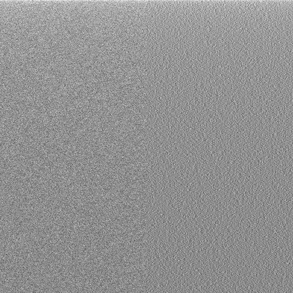

Visiting a high school with my son, in the Maths classroom there was a poster on the wall, which visualised primes numbers.  I only half remember what it said (taking a photo might have been a little bit weird, in the circumstances) but I think the little write-up at the bottom said that the calculations had been performed in Python, using trial division, and had taken half an hour.  This immediately made me think of a [prime sieve](https://en.wikipedia.org/wiki/Sieve_of_Eratosthenes), so later I had a play with a sieve I had written in Python 3.  I now think I must be misremembering, as I cannot see how even trial division could take half an hour in Python (even some years ago).

<!--more-->

A 1000 by 1000 grid is quite a boring image, so I compute the first $10^8$ primes (which takes about a minute for my sieve to compute) and plotted on a 10000 square pixel grid.  This results in an almost black square, so I resampled and increased the brightness (in Python directly) which results in a pleasing picture, showing a slow decay in density, in line with the [prime number theorem](https://en.wikipedia.org/wiki/Prime_number_theorem).  One might think that the primes are roughly randomly distributed, but [this question](https://math.stackexchange.com/questions/421353/are-primes-randomly-distributed) on math.stackexchange will put you right on this score.  To experiment with visualising, I chose numbers are random, but in line with the decreasing density suggested by the prime number theorem.  The result does look visually rather different:

To the left is the distribution of primes, and to the right random numbers.  To my eyes, there is a clear difference.

Finally, a [link to an undergraduate project](http://math.uni.lu/eml/projects/reports/prime-distribution.pdf) which explores some further ideas for visualisation.

Code available [on github](https://github.com/MatthewDaws/Python_bits/tree/master/primes)
