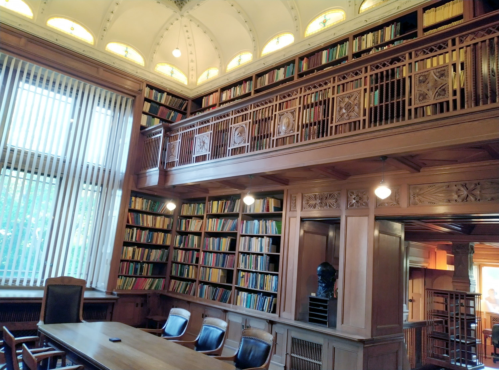

I spend last week at the [Institute Mittag-Leffler](https://www.mittag-leffler.se/) in a suburb of Stockholm, attending the [Noncommutative Harmonic Analysis and Quantum Information](https://www.mittag-leffler.se/activities/noncommutative-harmonic-analysis-and-quantum-information/) conference.  The institute is lovely, being comprised of a large, old mansion, various accommodation blocks, a seminar building, all set in lovely grounds.  The weather couldn't have been nicer (well, too hot for me, but I'd probably be happy spending the summer near the arctic circle).  As the [history page](https://www.mittag-leffler.se/about-us/history/) explains, the mansion belonged to Mittag-Leffler, and was left in his will to form a Mathematics research institute, but sadly the Great Depression eroded his legacy to the extent that the institute couldn't function as envisaged until the latter part of the 20th century, when additional funding was found.  If you get the chance to visit, I highly recommend it.

The mansion also houses an amazing [Mathematics library](https://www.mittag-leffler.se/about-us/library/).  I took a little photo:

<!--more-->

It was fun to explore, and to browse the shelves, but I'm not sure I hit upon any finds.  I haven't spent time in such a library in a long time: okay, my present university's library doesn't have a Mathematics section worth browsing, outside of teaching interest, but really the internet seemed to have killed physical libraries.  It's just too easy to search some database from my computer, or browse ebooks, or try to piece together what I need from random lectures notes found online.  I wonder what we've lost by this.  A physical library somehow embodies the interconnectedness of Maths, instead of the silos which electronic searches can encourage.  It also made physical the sheer _vastness_ of Mathematics, and the sheer impossibility of knowing more than a fraction of it.

The conference itself was also fun.  I am dipping my toes in the waters of Quantum Information, and it was nice to see people I've met before but haven't seen for sometime, and also to meet new people, and put faces to the names of authors whose papers I've been reading of late.  The Noncommutative Harmonic Analysis part was more alien to me, but I think I learnt a lot.  It became clear across the week that the organisers had asked the plenary speakers to use the extra time they had to provide introductions to their topics.  This worked wonderfully well in my opinion, and I got a huge amount out of these talks.  In fact, all the talks were really accessible, with almost everyone making a real effort to be accessible.  There were some good board talks: it's takes real discipline to give a good board talk, but from the perspective of the audience, it's lovely to be able to make full notes, and proceed at a speed where everything can be understood.  It is possible to give a bad board talk-- saying out loud everything you'd put on slides, but writing rather little-- but no such talk was in evidence.

I helped organise a [meeting in Glasgow](https://sites.google.com/view/quantumgroupsandinteractions) a couple of week's ago.  I must say that my other two fellow organisers did the lion's share of the work behind the scenes.  We took a different approach towards speakers, giving everyone equal time, which is more democratic, but which didn't leave room to instruct certain speakers to provide introductions.  But it was a more specialised conference, with most people present being experts.  It was a good week (even if I say so myself!) and a good chance to see lots of recent work in (anaytic) Quantum Groups.  We also had a nice outing on Loch Lomand.
