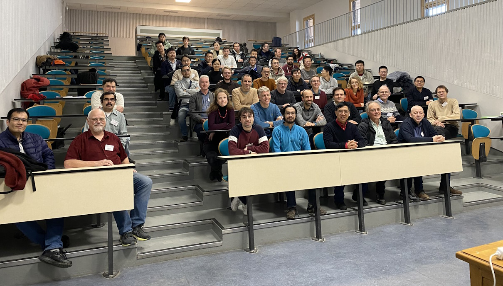

Somehow it is 2024 already.  I spent the week before Christmas at a pleasant conference in Besançon, France.  A photo of us all in the initial lecture theatre:

<!--more-->

I write "initial" as some (apparently vastly overrunning) refurbishment work meant we had to move rooms later in the week.  The old town of Besancon is interesting to wander around, architecturally distinct from the more modern suburbs in which the University of Franche-Comté is located, and nestled in the meander of the river Doubs.  The river, wide and fast flowing, and unlike anything I am used to from the Pennines here in the UK, was low; we had a nice conference dinner in a restaurant located on a boat.

The academic heart of the conference was probably around non-commutative $L^p$ spaces and harmonic analysis.  This is not my field, but after a few conferences which featured this topic a lot, and some good talks, I'm beginning to get a grip on what it's about.  However, the range of topics in the conference was wide, and it was nice to be exposed to things I wouldn't, say, have the time to read on the arXiv.

I spoke about the contents of <a href="https://arxiv.org/abs/2312.13626">Averaging multipliers on locally compact quantum groups</a> a new preprint, again authored with Jacek Krajczok and Christian Voigt.  We explore how to use an averaging procedure when one has a compact quantum subgroup to study multipliers and the Fourier algebra.  Applied to Drinfeld doubles of discrete quantum groups, this gives a precise correspondence between various "approximation properties" for the Double, and the corresponding "central" properties for the discrete quantum group.

A couple of projects have also come to a close over the break.  Our first paper with Jacek and Christian is now published with <a href="https://www.sciencedirect.com/science/article/pii/S0001870823005959">Advances</a>, while my <a href="https://arxiv.org/abs/2203.08716">paper about Quantum Graphs</a> has been accepted by the Communications of the American Mathematical Society (which is an open-access journal, fulfilling my obligations under the terms of having EPSRC funding).
